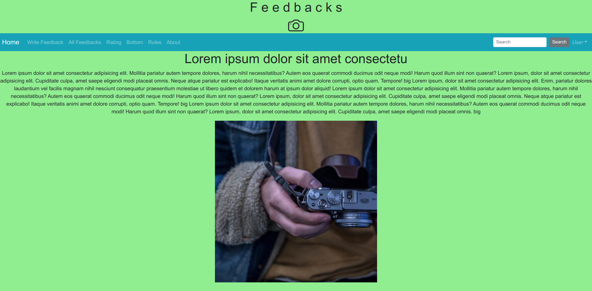
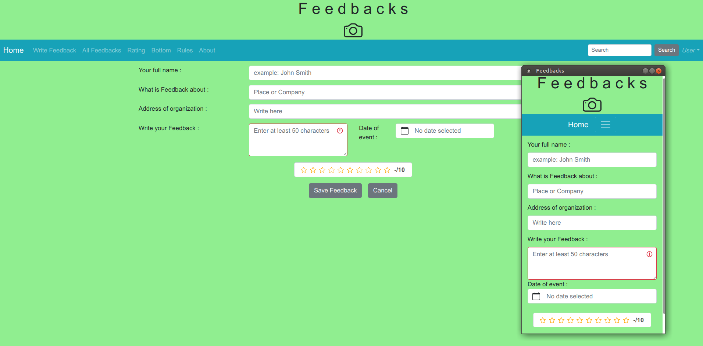
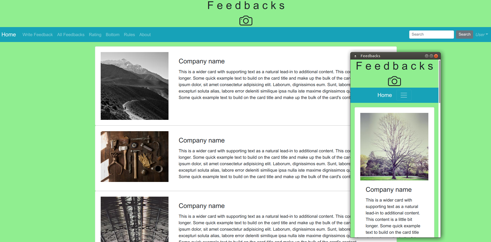

# Feedbacks 

It is simplest Single Page Application. It uses Node.js, Vue+Bootstrap, Vue-Route Express, PostgresQL etc. 
This how it looks like(with mobile view include) : 
<p>



</p>

There is DB realize through "node-postgres" .

## Project setup
```
npm install
```

### Compiles and hot-reloads for development
```
npm run serve
```

### Compiles and minifies for production
```
npm run build
```

### Lints and fixes files
```
npm run lint
```

### Customize configuration
See [Configuration Reference](https://cli.vuejs.org/config/).


